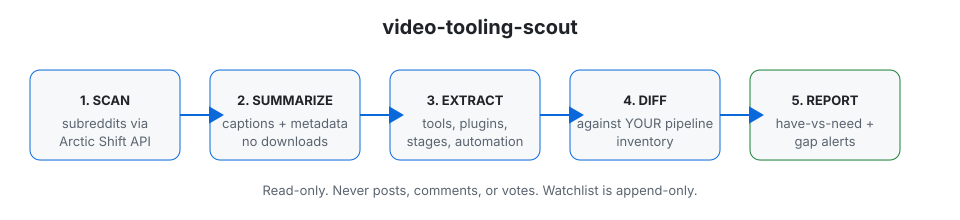

# skill_library

[](https://github.com/Emperiusm/skill_library/actions/workflows/ci.yml)
[](LICENSE.md)
[](https://www.python.org)
[](https://github.com/Emperiusm/skill_library)

A library of executable skills. Each directory under [`skills/`](skills/) is one skill
(a `SKILL.md` playbook plus its scripts and references); [`skillset/`](skillset/) holds
compressed knowledge cards learned from scout runs (reference notes, not executable skills).

| Skill | What it teaches |
|---|---|
| [`video-tooling-scout`](skills/video-tooling-scout/SKILL.md) | Scout tooling videos on Reddit, extract every tool/pipeline shown, and diff against your pipeline inventories to produce have-vs-need reports with gap alerts. |
| [`cinematic-cavern`](skills/cinematic-cavern/SKILL.md) | Build a cinematic cavern scene end to end: Blender blockout, ZBrush sculpt, game-mesh reduction, Substance bake and PBR materials, Unreal export, scripted repairs, a C++ height-field water solver, player-to-water contact, Houdini waterfall, final assembly. |

<picture>
  <source media="(prefers-color-scheme: dark)" srcset="docs/assets/hero-dark.svg">
  
</picture>

***video-tooling-scout turns "what are other people using to make game assets?" into a maintained,
evidence-based answer.** It watches the subreddits you choose for video posts, extracts the tooling
each video demonstrates (software, plugins, pipeline stages, automation), and diffs it against your
own pipeline inventories to produce per-pipeline have-vs-need tables with gap recommendations. It
never posts, comments, or votes. It only reads.*

> [!NOTE]
> **What ships today is the read loop:** scan → summarize → extract → diff → report, plus the
> append-only watchlist with trend detection and a keyword/meaning-matched P1/P2 gap-alert list.
> What is deliberately not here: any posting or commenting, any automatic tool installation, and any
> download of video files in scheduled runs. See [Status](#status-and-evidence).

<table>
<tr>
<td valign="top" width="33%">

***Get going***
- [Install](#install)
- [Quick start](#quick-start)
- [Schedule it](#scheduling)

</td>
<td valign="top" width="33%">

***How it works***
- [The map](#the-map)
- [Scan](#1-scan)
- [Summarize](#2-summarize-captions-and-metadata-only)
- [Extract and diff](#3-extract-tooling-4-diff-against-your-inventories)
- [Watchlist trending](#watchlist-trending-and-gap-alerts)

</td>
<td valign="top" width="33%">

***Why you can trust it***
- [Why it exists](#why-it-exists)
- [Status and evidence](#status-and-evidence)
- [Security and known limits](#security-and-known-limits)
- [Licence](#licence)

</td>
</tr>
</table>

## The map

<picture>
  <source media="(prefers-color-scheme: dark)" srcset="docs/assets/hero-dark.svg">
  
</picture>

The loop is one direction: Reddit → your reports directory. The scout's only persistent state is
`skills/video-tooling-scout/references/tooling-watchlist.md`, which is append-only: entries are never deleted, only annotated
(adopted, superseded, skipped, seen-again dates). A claim of "your pipeline has this" requires
evidence (a file path, a CI workflow, or an audit citation); "probably has it" is treated as NEED
until verified.

## Why it exists

Scrolling game-dev subreddits for tooling ideas doesn't scale, and memory doesn't either: the same
interesting tool resurfaces three times and nobody notices it's a trend. video-tooling-scout
externalizes that memory. It scores posts by tooling relevance (not just votes), summarizes each
video from captions and metadata, extracts every named tool and pipeline stage with a source quote,
and compares the findings against a written inventory of *your* pipeline, so the output is "here's
what you're missing" instead of "here's what's popular".

| Principle | What it means in practice |
|---|---|
| **Evidence over vibes** | A tool is HAVE only with repo evidence. A tool is recommended only with a source quote from a video or its comments. |
| **Reads only** | No posting, commenting, voting, or tool installation. The public web is read through public APIs. |
| **Scheduled runs never ask** | Cron/ unattended runs are captions-and-metadata only and must never trigger approval or login prompts. Downloads happen only in interactive runs, and only with the operator's explicit per-video go-ahead. |
| **Memory is append-only** | The watchlist and the gap list are annotated, never rewritten. History survives the operator's changing mind. |

<details>
<summary><b>Vocabulary</b></summary>

| Term | Meaning |
|---|---|
| **Scan** | `skills/video-tooling-scout/scripts/scan_videos.py`: pulls recent video posts from `skills/video-tooling-scout/subreddits.yaml` via the Arctic Shift public API and ranks them by tooling relevance × engagement. |
| **Pipeline inventory** | A `skills/video-tooling-scout/references/*-pipeline-inventory.md` file describing what your pipeline already does (HAVE) and verified-absent gaps (NEED). Copy [`skills/video-tooling-scout/references/example-pipeline-inventory.md`](skills/video-tooling-scout/references/example-pipeline-inventory.md) to start. |
| **Have-vs-need** | Per-inventory table marking each found tool HAVE / PARTIAL / NEED with pipeline evidence and a recommendation (adopt now / backlog / watchlist / skip + why). |
| **Gap alert** | An extracted tool that matches [`skills/video-tooling-scout/references/p1-gaps.md`](skills/video-tooling-scout/references/p1-gaps.md) by keyword *or* meaning. Reported at the very top of the run report and the operator summary. |
| **Watchlist** | [`skills/video-tooling-scout/references/tooling-watchlist.md`](skills/video-tooling-scout/references/tooling-watchlist.md): the keep-on-the-side list of interesting tools. `skills/video-tooling-scout/scripts/trend_watchlist.py` annotates reappearances; three or more sightings flag a tool TRENDING. |
| **Operator** | The human running the scout. Only the operator approves downloads; scheduled runs never ask. |

</details>

## Install

| You need | For |
|---|---|
| **Python 3.11+** on `PATH` | Everything. There are **no runtime dependencies**: every script is standard-library only (`urllib`, `json`, `re`), so installing it can't hit a resolver conflict. |
| `git` | Cloning, and the CI compile check |
| A captions-capable video summarizer (optional) | Deeper YouTube/Vimeo analysis. The loop works without one: captionless videos fall back to metadata + description, and native Reddit videos are analyzed from post text and comments. |
| A reports directory of your choice | Run output, e.g. `~/video-tooling-scout-reports/` |

```bash
git clone https://github.com/Emperiusm/skill_library.git && cd skill_library
python3 -m py_compile skills/video-tooling-scout/scripts/*.py   # the whole gate: stdlib only, compiles clean
```

Copy the templates before your first run:

```bash
cp skills/video-tooling-scout/references/example-pipeline-inventory.md \
   skills/video-tooling-scout/references/my-pipeline-inventory.md
# then edit my-pipeline-inventory.md, p1-gaps.md, and
# skills/video-tooling-scout/subreddits.yaml
```

## Quick start

New here? Read [`skills/video-tooling-scout/references/example-run-report.md`](skills/video-tooling-scout/references/example-run-report.md) first:
it's a full real run (24 videos, every one audited at full depth) showing exactly what each step below produces. Then:

```bash
# 1. Scan the last 2 days of your subreddits, ranked by tooling relevance.
python3 skills/video-tooling-scout/scripts/scan_videos.py 2 > /tmp/scan.json

# 2. Summarize the top videos (captions/metadata; your summarizer of choice),
#    or pull the comment threads where the tooling details live:
python3 skills/video-tooling-scout/scripts/fetch_comments.py <post_id>:<num_comments> [...]

# 3. Extract tooling per video (software, plugins, stages, automation),
#    each with a source quote, and diff against your inventories.

# 4. Flag reappearances on the watchlist (appends "seen again <date>"):
python3 skills/video-tooling-scout/scripts/trend_watchlist.py --date 2026-09-27 "<tool 1>" "<tool 2>" ...

# 5. Write the report (have-vs-need-YYYY-MM-DD.md) to your reports directory
#    and append genuinely new tools to
#    skills/video-tooling-scout/references/tooling-watchlist.md.
```

See [`SKILL.md`](skills/video-tooling-scout/SKILL.md) for the full operator playbook: the workflow steps, the output
contract every run delivers, and the operating rules (including the approval rule).

## How it works

### 1. Scan

`skills/video-tooling-scout/scripts/scan_videos.py` reads `skills/video-tooling-scout/subreddits.yaml` (hand-editable; one subreddit per line, no `r/` prefix), pulls recent
posts from each via the Arctic Shift public API (`https://arctic-shift.photon-reddit.com`), and
keeps video posts: YouTube / Vimeo links and native Reddit video. Posts below `min_score`
(default 20) are dropped. Each survivor is scored:

- **Tooling relevance:** keyword hits against a built-in list (blender, houdini, substance, rig,
  retopo, UV, LOD, nanite, bake, mocap, comfyui, text-to-3d, geometry nodes, CI/CD, …).
- **Engagement:** score capped at 500, scaled down. Posts with **zero** tooling keywords get only
  20% of the engagement contribution, so a viral pure-eye-candy clip can't outrank real tooling
  content on votes alone.

Output is ranked JSON to stdout: title, author, URL, permalink, score, comment count, tooling
keyword hits, and a relevance number. Deep analysis is capped (default 8 videos per run).

### 2. Summarize (captions and metadata only)

- **YouTube / Vimeo:** your captions-first summarizer. Never invent transcript lines or tool
  mentions. If a video has no captions, use its metadata + description and move on.
- **Native Reddit video:** the clip is short; the signal is in the post text and the comments.
  `skills/video-tooling-scout/scripts/fetch_comments.py <post_id>[:num_comments]` pulls top comments from Arctic Shift, and when
  Arctic Shift returns zero comments for a post that has some (a known index coverage gap), it
  falls back automatically: old Reddit JSON first, then the PullPush API. Also check YouTube
  demo/tutorial links found in the comments; they often contain the real breakdown.

The default loop **never downloads video or model files**. The approval rule is in
[`SKILL.md`](skills/video-tooling-scout/SKILL.md): scheduled runs are strict (kill anything that hits an approval gate,
never retry); interactive runs may download a captionless video for transcription only with the
operator's explicit per-video go-ahead, capped at 3 per run, with a per-host 3-prompt kill guard
so a retry loop can never recur.

### 3. Extract tooling, 4. Diff against your inventories

Per video, reconstruct the full workflow: exact tools used, a phased workflow with `Do`,
`Check`, and `Why` per phase, exact parameters/values/costs/benchmarks where the captions,
comments, or metadata support them, and the human/process principles underneath. Never
invent transcript lines or parameters; label inferences clearly. Videos that can't reach
full depth on captions/metadata alone are marked `DEPTH-LIMITED` with the reason stated.
See [`SKILL.md`](skills/video-tooling-scout/SKILL.md) for the complete audit standard. Then diff against every `skills/video-tooling-scout/references/*-pipeline-inventory.md`: one
have-vs-need table per inventory, primary first, each tool marked HAVE / PARTIAL / NEED with
pipeline evidence and a recommendation (adopt now / backlog / watchlist / skip + why). A tool
can be NEED for one pipeline and HAVE for another; the tables say so.

### Watchlist trending and gap alerts

After extraction, `skills/video-tooling-scout/scripts/trend_watchlist.py --date YYYY-MM-DD "<tool>" ...` compares tool names
against the watchlist (case-insensitive substring + token overlap, both directions), appends
"seen again <date>" to reappearing rows in place, and prints a "Watchlist trending" snippet for
the report. A tool seen three or more times is flagged **TRENDING**.

Separately, every extracted tool is checked against `skills/video-tooling-scout/references/p1-gaps.md` by keyword **and**
by meaning. Matches become **gap alerts** at the very top of the report and the operator's
summary, never buried in the tables.

## Scheduling

The loop is designed for a daily cron: scan the prior two days, deep-analyze up to 8 videos,
diff against all inventories, check gap alerts, detect trending tools, update the watchlist,
write a dated report. Two constraints for scheduled runs:

1. **No approvals, ever.** Captions and metadata only. If a command hits an approval gate, kill
   it and skip the item; never retry. If a host prompts repeatedly, stop hitting it for the rest
   of the run.
2. **Explicit paths.** Cron workers don't inherit your shell `PATH`; resolve `python3` (e.g.
   `/usr/bin/python3`) and any script paths explicitly in the crontab.

Example:

```cron
18 8 * * * cd /path/to/skill_library && /usr/bin/python3 skills/video-tooling-scout/scripts/scan_videos.py 2 > ~/video-tooling-scout-reports/scan-$(date +\%F).json
```

(Adapt to your full run wrapper; the report writing and watchlist update are operator steps per
[`SKILL.md`](skills/video-tooling-scout/SKILL.md).)

## Status and evidence

| Component | Status | Evidence |
|---|---|---|
| `skills/video-tooling-scout/scripts/scan_videos.py` | Implemented, live against Arctic Shift | Ranked JSON output; zero-tooling-signal downweight verified in runs |
| `skills/video-tooling-scout/scripts/fetch_comments.py` | Implemented, fallback chain verified | Old Reddit JSON bot-walled from some sandboxes; PullPush recovered comments in testing |
| `skills/video-tooling-scout/scripts/trend_watchlist.py` | Implemented | Appends "seen again" in place; TRENDING flag at 3+ sightings |
| Watchlist / gap list | Append-only by convention | `trend_watchlist.py` never deletes; `p1-gaps.md` maintained the same way |
| CI | `py_compile` on `skills/video-tooling-scout/scripts/*.py` | [`.github/workflows/ci.yml`](.github/workflows/ci.yml) |
| Tests | None beyond compilation | Honest limit: no unit test suite ships yet |

**Not implemented:** automatic posting/commenting (deliberately out of scope), automatic tool
installation, video downloading in scheduled runs, a web UI, multi-operator support.

## Security and known limits

The threat model and what's deliberately not defended are in [`SECURITY.md`](SECURITY.md).
The short version:

| Limit | What it means |
|---|---|
| **Third-party APIs are trusted, not verified** | Arctic Shift, PullPush, and Reddit JSON can be down, rate-limited, or stale. Runs degrade gracefully and say so; they don't verify the APIs' answers. |
| **Captions are author-supplied** | They can be wrong. Every extracted claim should carry a source quote so the operator can check. |
| **Watchlist matching is fuzzy** | Token-overlap matching can near-miss. Matches are surfaced for the operator, not trusted blindly. |
| **No test suite** | The gate is `python3 -m py_compile skills/video-tooling-scout/scripts/*.py`. Behavioral regressions are caught by the operator reading reports, not by tests. |
| **The example inventory is fictional** | `skills/video-tooling-scout/references/example-pipeline-inventory.md` is a template. Your have-vs-need tables are only as honest as the inventory you write. |

## Documentation

| Document | What it covers |
|---|---|
| [`SKILL.md`](skills/video-tooling-scout/SKILL.md) | **The operator playbook.** Workflow steps, output contract, operating rules. This governs a run. |
| [`skills/video-tooling-scout/references/example-run-report.md`](skills/video-tooling-scout/references/example-run-report.md) | **A finished run, in full.** Read this first: gap alerts, per-inventory have-vs-need tables, trending, non-goals, and a full-depth workflow audit for every one of the 25 audited videos. This is what your runs should look like. |
| [`skillset/`](skillset/) | **The library.** Durable skill cards promoted from run reports: what each learned skill does, where it was learned from, the evidence, the compressed workflow. Four example cards included. |
| [`skills/video-tooling-scout/references/example-pipeline-inventory.md`](skills/video-tooling-scout/references/example-pipeline-inventory.md) | Template pipeline inventory (HAVE with evidence, verified NEED). Copy and fill in. |
| [`skills/video-tooling-scout/references/p1-gaps.md`](skills/video-tooling-scout/references/p1-gaps.md) | Gap-alert template: format, example rows, maintenance rules. |
| [`skills/video-tooling-scout/references/tooling-watchlist.md`](skills/video-tooling-scout/references/tooling-watchlist.md) | The append-only watchlist; 3 labeled example rows show the format. |
| [`skills/video-tooling-scout/subreddits.yaml`](skills/video-tooling-scout/subreddits.yaml) | Hand-editable subreddit list and scan defaults. |
| [`SECURITY.md`](SECURITY.md) | Threat model, known limits, how to report a vulnerability. |

## Contributing

The short version:

- **Standard library only.** Every script must run on `python3` with no installs.
  A dependency added to look sophisticated is supply-chain surface bought for nothing.
- **`python3 -m py_compile skills/video-tooling-scout/scripts/*.py` must pass.** CI enforces it.
- **Keep it read-only.** No posting, commenting, voting, or downloading in the default
  loop. Proposals that add outbound actions need an explicit operator-approval design.
- **Don't invent evidence.** Summaries cite sources; HAVE requires a cited file path,
  workflow, or audit.
- **By submitting a contribution you agree it may be distributed under the PolyForm
  Noncommercial licence** (see [`LICENSE.md`](LICENSE.md)).

## Security reporting

Please don't open a public issue for a vulnerability. Use GitHub's **private vulnerability
reporting** (the repository's *Security* tab → *Report a vulnerability*). What the project
defends, and what it doesn't, is in [`SECURITY.md`](SECURITY.md).

## Licence

video-tooling-scout is **source-available** under the [PolyForm Noncommercial License
1.0.0](LICENSE.md). It isn't open source.

| | |
|---|---|
| **Free** | Non-commercial use: research, experiments, personal study and hobby projects, and use by charities, educational institutions, public research organisations and government. Keep the `Required Notice:` line from [`LICENSE.md`](LICENSE.md) with any copy you share. |
| **Paid** | Commercial use, including internal use inside a company. Contact the copyright holder for a commercial licence. |
